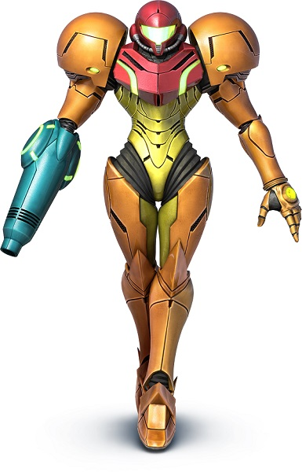
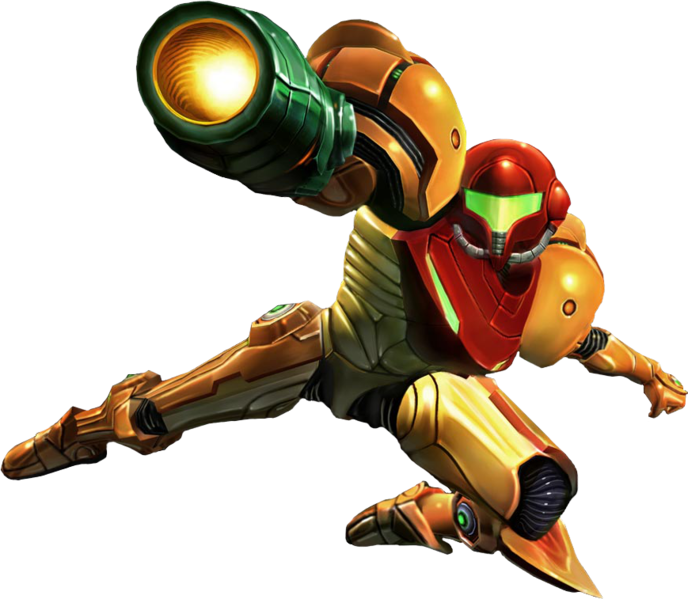

  

Projecto Individual - VideoGames API

  

El Desafio fue crear una aplicación en donde se pueda ver la información de distintos videogames utlizando una API externa y una Base de Datos propia.

La aplicación empieza mostrando una Landing de inicio, la cual nos redirige al Home cuando se presione el boton  'press start'.

La misma cuenta con una Barra de Navegacion en donde se muestran diferentes opciones:

Una Barra de Busqueda para traer un juego determinado y cualquier considencia con lo escrito en la busqueda;

Botones de Ordenamiento Alfabetico de los Juegos, tanto asendente como desendente;

Un Formulario Controlado de creacion de Video Juegos, el cual se agrega a nuestra base de datos.

Mientras carga el Home, podremos ver un loading animado. Una vez cargado podremos ver una serie de Cartas en donde se muestran cada uno de los juegos.

En cada una de las Cartas, al darle click sobre el nombre nos direcciona a una Pagina de Detalle, donde se podra obtener informacion ampliada del juego.

Podremos navegar por cada una de las paginas del Home gracias al paginado.

-Tecnologías Utilizadas:

 BackEnd :

| JavaScript |   Node.js  | Express |  Postgres  | Sequelize |

FrontEnd :

| React | Redux | HTML | CSS |

--------------------------------------------------------------------------------------------
Individual Project - VideoGames API

  

The challenge was to create an application where you can see the information of different videogames using an external API and an own database.

The application starts showing a Landing page, which redirects us to Home when the 'press start' button is pressed.

It has a Navigation Bar where different options are shown:

A Search Bar to bring up a particular game and any considerations with what is typed in the search;

Alphabetical sorting buttons of the games, both ascending and descending;

A Controlled Form of creation of Video Games, which is added to our database.

While loading the Home, we will be able to see an animated loading. Once loaded we will be able to see a series of Cards where each one of the games are shown.

In each of the cards, clicking on the name will take you to a detail page, where you can get more information about the game.

We will be able to navigate through each one of the Home pages thanks to the pagination.

-Technologies used:

 BackEnd :

| JavaScript |   Node.js  | Express |  Postgres  | Sequelize |

FrontEnd :

| React | Redux | HTML | CSS |